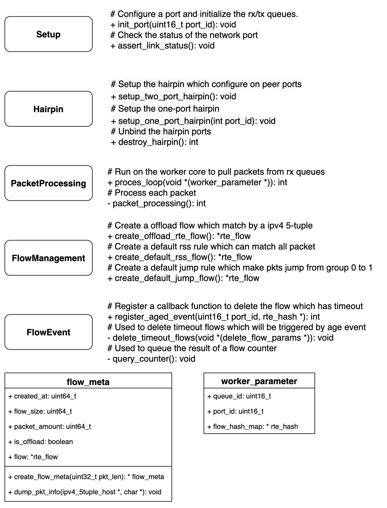
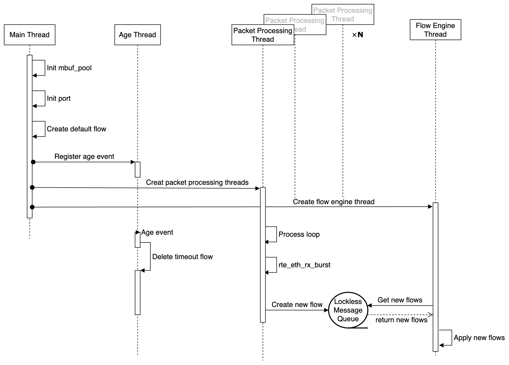

# Smart Offload

[](https://github.com/chen622/smart_offload/actions/workflows/build.yml)
[](https://github.com/chen622/smart_offload/blob/main/README-ZH.md)
[](https://github.com/chen622/smart_offload/blob/main/README.md)

## 一、主要功能

- 将流经的数据包上送到处理线程中，并在第 n 个包后下发对应的流表进行卸载
- 下发的流表可以使网卡对数据包进行计数、超时判断、hairpin转发等操作
- 能够定期对已卸载的流进行数量、大小的统计
- 对于一段时间未使用的流表进行删除处理

## 二、模块设计



## 三、线程设计



## 三、待验证部分

- [x]  对流下发的速率上限进行测试
- [ ]  对流的数量上限进行测试
- [ ]  对空pattern的rte_flow使用rss
- [ ]  一组hairpin是否可以实现双向通信
- [x]  如何实现定时查询 age？回调？alarm触发？

部分测试结果：https://chenmingc.notion.site/SMTO-835fda18304c44e8862697f1ebcde53b

## 四、快速上手

### 配置要求：
- DPDK 20.11.5
- 配备 Mellanox/Nvidia 智能网卡的 x86 服务器

### 运行指令
```bash
mkdir build && cd build
cmake ..
make
# -l 用于指定核心 -a 用于指定网口
./smart_offload -l 1-9 -a 82:00.0
```

## 五、问题

### Unable to set Power Management Environment

无法锁定 CPU 的运行频率，可能是由于缺乏相关权限。可以通过增加一个定义`-DVM=true`来关闭此功能